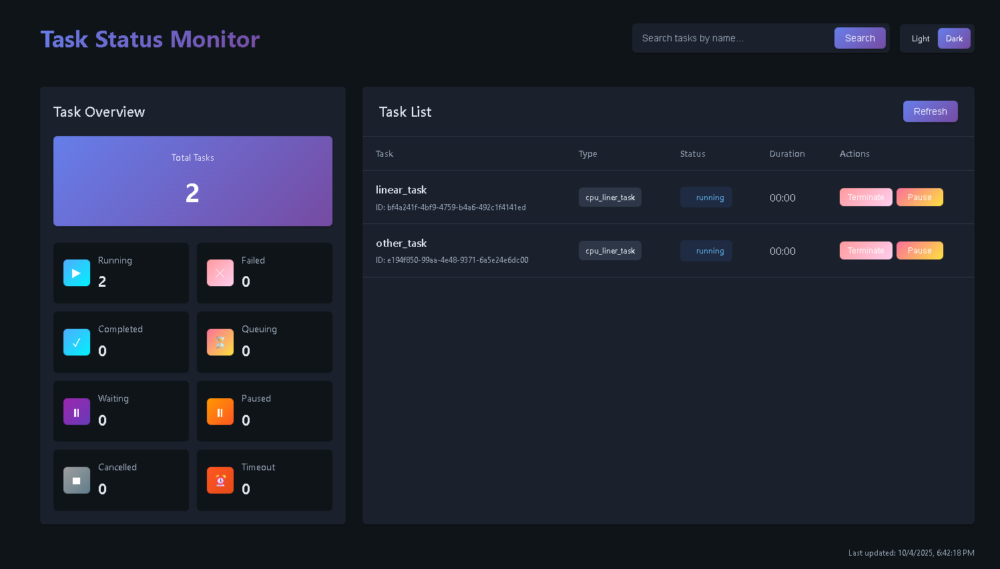

## 开启监视页面

网页端可以查看任务状态,运行时间,可以（暂停,终止,恢复）任务,建议大部分时候使用该网络页面去控制任务

- 使用示例:

```python
from task_scheduling.server_webui import start_task_status_ui

# 启动网页界面，访问: http://localhost:8000
start_task_status_ui()
```

- 功能说明

- `Stop Adding Task` 停止任务添加到调度器
- `Task Overview` 调度器各类任务状态统计

- 效果图
  